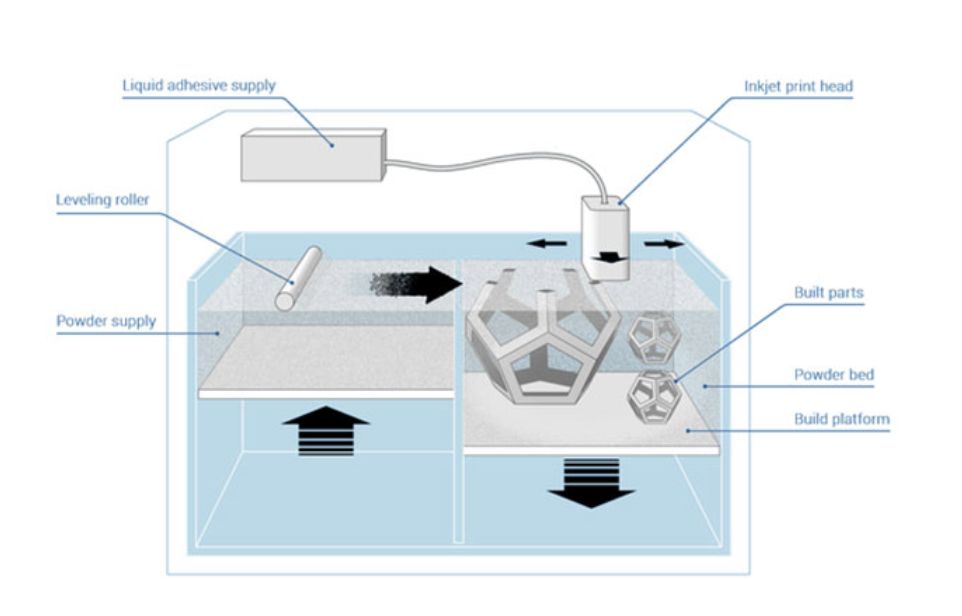
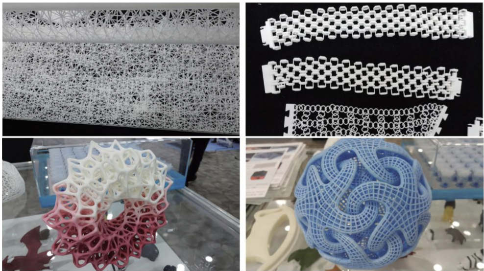

이번 포스팅에서는 선택적 레이저 소결 방식으로 불리는 SLS (Selective Laser Sintering) 3D 프린터에 대해 소개하겠습니다. SLS 3D 프린터는 SLS 방식으로 작동하는 3D 프린터입니다. SLS 방식이 어떻게 탄생했고, 원리와 장단점이 무엇인지, 실제 시중에 판매하고 있는 제품의 가격에 대해서도 알아보겠습니다.

## **1. 분말적층응용결합 방식에 대한 이해**
먼저 SLS 방식을 이해하기 위해서는 ‘분말적층응용결합 방식’이란 단어에 대한 이해가 있어야 합니다. 

분말적층용융결합 방식은 위의 이미지처럼 결합제 분사 방식과 같이 파우더를 베드 플랫폼 위에 놓고, 레이저나 전자빔 등과 같은 에너지원을 이용하여 선택적으로 용융시켜 적층 제조하는 방법입니다. 

고체 형태인 파우더를 롤러나 블레이드를 이용하여 압력을 가하여 베드 플랫폼 위에 얇고 단단하게 만든 다음 레이저나 전자빔 등과 같은 에너지원으로 파우더 소재의 녹는점에 가까운 온도로 용융시킵니다. 그렇게 하면 파우더는 서로 접한 면에서 소재가 녹아 접합이 이루어지거나 일부가 더 붙으면서 쌓아가면서 제조가 되는 방식입니다. 

전반적으로 이런 분말적층용융결합 방식은 금속, 폴리머, 세라믹 등 다양한 재료를 사용할 수 있고, 시제품 뿐 아니라 완제품 등 실제 제품으로도 사용가능하지만, 그만큼 가격이 비싸다는 단점이 있습니다.

SLS 방식도 이 분말적층응용결합 방식 중 하나인 것입니다.


## **2. SLS 방식의 역사**
SLS 방식은 1986년 텍사스 대학의 Joseph J. Beamen 교수팀에 의해 개발되어 특허를 출원한 기술입니다. 이 기술을 이용하여 DTM사를 설립했으나, 2011년 미국의 3D systems에 인수합병 되었습니다. 현재 특허는 2014년에 만료된 상황입니다. 

즉, 현재 전통있는 SLS 방식의 3D 프린터를 판매하는 곳은 특허를 갖고 있던 3D Systems 회사 입니다. 

## **3. SLS 방식 vs SLM 방식**
SLS 방식과 SLM 방식 모두 앞에서 설명했던 분말적층응용결합 방식에 대한 이해가 있다면 쉽게 차이를 느낄 수 있습니다. 
SLS 의 단어는 영어로 Selective Laser Sintering 입니다. 한국어로 선택적 레이저 소결이라고 합니다. 말 그대로 레이저를 이용하여 선택적으로 소결한다는 의미이며, 여기서 소결이란 뜻은 파우더 같은 분말 입자들에 열을 가하여 하나의 덩어리로 만드는 것을 뜻합니다.

SLS 방식 외에도 세부적으로 들어가면 SLM 방식으로 분류할 수 있습니다. 하지만 대부분 SLS 3D 프린터라고 부릅니다. 방식에는 큰 차이가 없기 때문입니다. 
SLM 3D 프린터는 영어로 Selective Laser Melting 이며, 한국어로는 선택적 레이저 용융 입니다. 용융은 녹는다는 뜻입니다. 실질적으로 제조하는 방식은 크게 다르지 않지만 차이점은 녹는점에 있습니다.
녹는점은 고체를 액체로 바꾸는 지점을 말합니다. 녹는점을 넘지 않고 파우더 분말 입자에 레이저를 가하여 녹는점 근처에서 하나의 덩어리로 만드는 과정을 SLS 방식의 3D 프린터라고 부르며, 녹는점을 넘어서 고체를 액체화 시켜 쌓아 제조하는 방식을 SLM 3D 프린터라고 세분화 합니다. 

## **4. SLS 방식의 장단점**
파우더 형태로 이루어진 소재를 롤러를 이용해 한 층씩 레이어를 만들어주고 레이저 빔을 반사시킬 수 있는 거울인 다이내믹 미러(Dynamic Mirror)를 통해 적당한 각도에서 반사시켜 선택적으로 구조물을 적층 제조합니다.

장점은 다양한 소재를 사용할 수 있기 때문에, 다양한 영역으로의 제품을 응용하여 생산할 수 있고 다양한 목적으로 사용할 수 있게 됩니다. 
하지만 단점으로는 다양한 소재를 쓰는 만큼 다양한 소재의 각자 다른 녹는점과 나타나는 특성이 다르기 때문에, 각 소재마다 적절한 가열 온도를 알고 있어야 하며, 그에 맞춰 레이저 조작을 해야한다는 점이 있습니다. 


## **5. SLS 3D 프린터 가격**
보급형도 SLS 방식의 경우 매우 비싼편이라 평균적인 가격이 3,000만원 정도로 보시면 됩니다. 산업용으로 나오는 장비들은 3억원 대가 넘게 가격이 형성되어 있습니다. 

그나마 가장 저렴한 가격으로 SLS 3D 프린터를 전문으로 만드는 회사가 있습니다. Sinterit 라는 회사이며, 이곳에서 출시한 Lisa SLS 3D Printer 가 $13,990 (한화 1,800만원) 로 가장 저렴한 SLS 프린터라고 보면 됩니다.

## **마치며**
SLS 프린터는 개인 가정용에서는 쓰기 어려운 3D 프린터입니다. 하지만 실제 제품을 제조하거나 고도로 발전된 프로토타입을 만드는 경우에는 적합한 산업용 3D 프린터 입니다. 

```toc
```