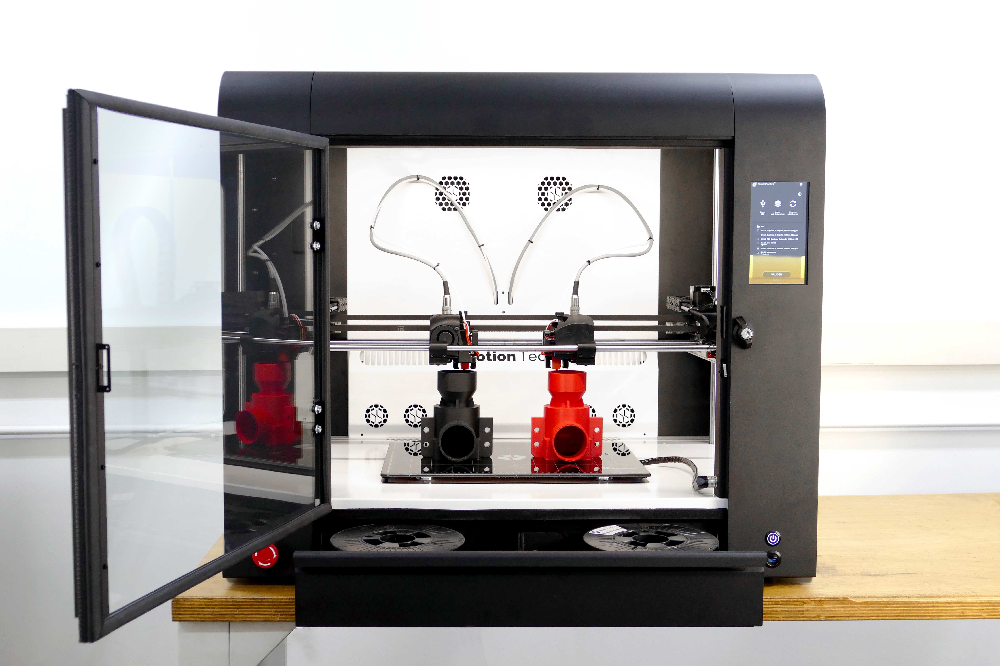

이번 포스팅에서는 3D 프린터 중에 가장 대중적으로 보급되어 있는 방식인 FDM 방식 및 FFF 방식의 원리와 장단점 및 레진에 대해 알아보겠습니다. 

## **1. 소재 압출 방식**
3D 프린터 FDM 방식과 FFF 프린터 방식 모두 소재 압출 방식을 사용하고 있습니다. 소재 압출 방식은 대중에게 가장 널리 알려지고 보급된 3D 프린터에 주로 사용합니다. 

ABS나 PLA 소재 등과 같이 열가소성 재료를 필라멘트 형태로 만들어 고온의 압출기에서 녹여 원하는 구조물 형태로 적층 제조하는 방식입니다. 주변에 쉽게 사용할 수 있는 3D프린팅 펜도 이와 같은 방식을 사용합니다.

소재 압출 방식은 FDM(Fused Deposition Modeling)이나 FFF(Fused Filament Fabrication)로 분류할 수 있는데, 방식에 있어서는 큰 차이가 없습니다. 

## **2.  FDM(Fused Depostion Modeling, 용융적층모델링)**
FDM 방식은 미국의 Stratasys를 설립한 S. Scott Crump가 1988년 딸을 위해 장난감 개구리를 만드는 도중 쉬운 방법을 찾다가 발명했습니다. 가열된 글루건을 이용하여 플라스틱을 녹여 평평한 표면에 쌓았고, 이 프로세스를 자동화하여 Crump는 그의 아내 Lisa와 함께 1989년 특허를 출원 및 보유하고 스트라타시스사를 설립하게 되었습니다. 

FDM 방식은 2009년 특허가 만료되었으나, 용어는 스트라타시스에서 상표로 등록한 용어로서 특허가 풀린 이후에도 다른 제조사가 사용할 수 없는 상황입니다.

FDM 방식은 FFF 방식의 3D 프린터와 다르게 2개의 노즐을 이용하여 서로 다른 재료를 사용합니다. 하나는 실제 출력하고자 하는 구조물을 적층 제조하기 위한 ABS 등의 재료를 주로 사용했고, 다른 하나는 출력하고자 하는 구조물에 허공에 떠 있는 부분이나 돌출부를 지지하기 위한 임시 구조물을 적층 제조한 PVA와 같은 수용성 서포트 재료입니다. 

3D 프린터의 적층 제조가 완성되면, 수용성 재료로 제조된 임시 구조물을 물이나 세제로 녹여 출력하고자 하는 구조물을 완성할 수 있습니다. 이와 같은 방식은 산업용에서 주로 사용합니다.

## **3. FFF(Fused Filament Fabrication, 용융압출적층조형)**
FFF 방식은 FDM 방식을 응용하여 개인이 쉽게 3D 프린터를 사용할 수 있게 만든 오픈소스 프로젝트입니다. FDM 용어에 관한 상표 분쟁을 방지하기 위하여 FFF 라는 용어를 사용하게 된 것입니다. 

영국의 Adrian Bowyer 교수가 Rep-Rap(Replicating Rapid Prototyping) 프로젝트를 이끌며 대중이 3D프린터를 저렴하게 사용할 수 있게 발판을 마련했습니다. 지금 현재 대부분 보급형으로 만들어지는 FDM 3D 프린터는 실질적으로 오픈소스 프로젝트 기술을 기반으로 판매를 하는 것입니다.

FFF 방식은 FDM 방식과 다르게 1개의 노즐만 사용하기 때문에 출력하고자 하는 구조물과 지지하기 위한 임시 구조물의 재료가 같습니다. 임시 구조물을 쉽게 제거하기 위해서는 출력하고자 하는 구조물의 디자인을 초기부터 잘 구상하여야 합니다. 만약 그러지 못하면 출력 후 임시 구조물을 제거하기 쉽지 않아 원하는 출력물을 얻을 수 없게 됩니다. FFF 방식에서는 주로 필라멘트 형태의 열가소성 수지인 PLA 소재나 ABS 소재를 사용하고 있습니다.

##  **마치며**
실제로 흔히 볼 수 있는 3D 프린터의 정식 명칭은 FFF 3D 프린터 입니다. FDM 3D 프린터는 원칙적으로는 2개의 노즐을 이용하여 산업용으로 쓰이고 있는 상황입니다. 
어찌되던 Rep-Rap 프로젝트 덕분에 전세계의 많은 사람들이 메이커 문화를 경험하며 문제를 해결하는 프로토타입을 만들 수 있게 되었습니다. 이 프로젝트 덕분에 사람들의 기술적인 진입장벽이 많이 낮아지게 되었고, 이는 인류의 기술 발전에 큰 영향을 미칠 것이라 생각합니다. 

```toc

```