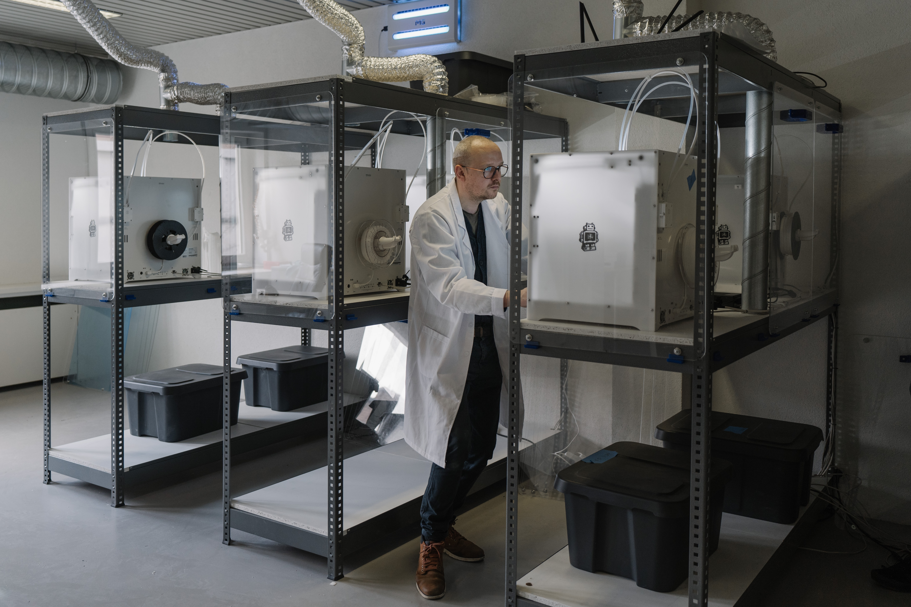

이번 포스팅에서는 3D 프린터 종류 중 하나인 SLA 방식의 3D 프린터의 원리에 대해 알아보고, 어떻게 탄생했는지와 프린터가 갖고 있는 장단점에 대해 알아보겠습니다.

##  **1. 광중합 방식 원리**
광중합 방식은 자외선이나 가시광선 등과 같은 빛의 조사로 액상 소재를 경화하여 적층 제조하는 방식입니다. 소재 분사 방식의 PolyJet 방식이나 MJM 방식의 경우도 광중합 방식을 적용한 경우입니다. 

빛을 조사하여 물성의 변화가 단단해지는 소재를 사용해야 하기 때문에 사용할 수 있는 소재가 매우 제한적입니다. 하지만 표면이 매끄럽고 높은 정밀도를 가진 구조물 제작이 가능하다는 점에서 큰 장점을 갖고 있는 방식입니다. 

앞으로 설명할 SLA 방식이 바로 이 광중합 방식의 원리를 이용하여 만들어진 3D 프린터 입니다. 

## **2. SLA(Stereo Lithography Apparatus) 탄생**
SLA 방식은 미국 3D Systems 사의 공동 창업자인 Charles W. Hull 이 1983년 발명했습니다. 1984년 특허 출원하여 1986년 특허를 보유하게 되면서, 특허를 기반으로 세계 최초의 3D 프린팅 회사인 3D Systems 사를 설립하게 되었습니다.

## **3. SLA 3D 프린터 장단점**
SLA 방식은 액체 상태의 광경화성수지가 담긴 수조 안에 자외선이나 레이저 빔 등의 광을 조사하여 한 층씩 경화를 시킵니다. 한 층씩 쌓아 올릴 때마다 베드 플랫폼이 위로 올라가면서 구조물이 형성되게 됩니다. 원료는 레이저, 다이내믹 미러(Dynamic Mirror), 수조, 액세 상태의 원료로 구성됩니다.

장점으로는 레이저를 반사시키는 다이내믹 거울을 이용해서 정밀하게 제조가 가능하다는 점과,, 표면이 매끄럽고 높은 정밀도를 가진다는 점이 있습니다.

하지만 단점으로 소재가 제한적이기 때문에, 원료를 구입하는 데 들어가는 비용이 매우 비싸고, 소재가 제한적이라 색상표현 역시 한계가 있습니다. 즉 전반적으로 유지비용이 많이 들어갑니다.

## **마치며**
이번 포스팅에서는 SLA 3D 프린터가 어떻게 탄생했으며, 어떤 원리로 정밀한 구조물을 만들어내는지 알아보았습니다. 소재가 제한적이더라도, 정밀한 구조체를 만들고 싶다면 SLA 3D 프린터는 한 번 사용해보시는 걸 추천 드립니다. 

```toc
```