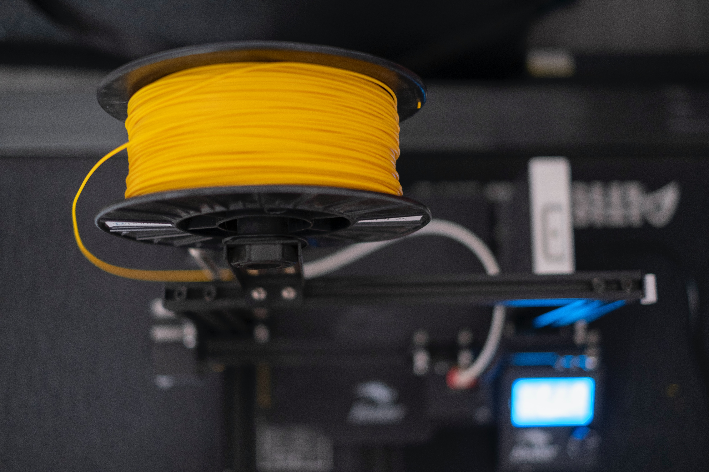
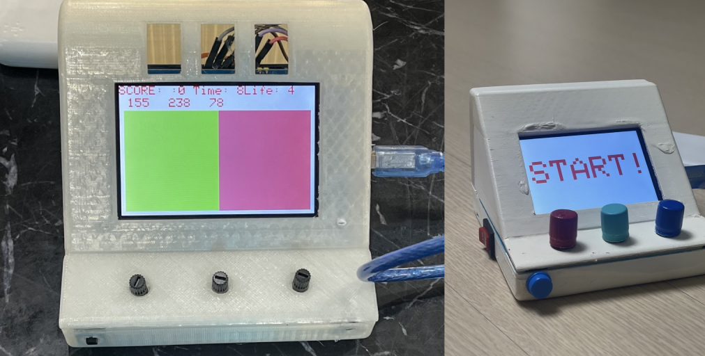

이번 포스팅에서는 대중적으로 이용되고 있는 3D 프린터인 FDM/FFF 방식의 3D 프린팅 기술에서 사용되는 재료에 대해 알아보겠습니다.

  
## **1\. 재료의 분류**

3D 프린터의 작동 방식에 따라 사용되는 재료도 달라집니다. 일반적으로 3D 프린팅 기술에 사용되는 재료는 열가소성 플라스틱, 파우더, 레진, 금속, 세라믹 등으로 구분됩니다. 

  

그 중 대중적으로 사용되고 있는 FDM/FFF 방식의 3D 프린터에서는 열가소성 플라스틱을 많이 사용하고 있습니다. 우리가 흔히 말하는 필라멘트가 바로 열가소성 플라스틱으로 커버의 이미지처럼 스풀 형태로 만들어져있습니다. 국내에서는 PLA 를 가장 많이 사용하고 있으며, 전세계적으로는 ABS 재료를 가장 많이 사용하고 있습니다. 

  

  

## **2\. 열가소성 플라스틱/필라멘트를 사용하는 이유**

열가소성 플라스틱을 이용하는 이유에 대해서는 3D 프린터 중 FDM (Fused Deposition Modeling) 또는 FFF (Fused Filament Fabrication) 방식의 3D 프린터 작동 방식에 대한 이해가 있어야 합니다.

<br/>

[3D 프린터 작동 방식 알아보기](/231107-fdm-3d-printer-and-fff-3d-printer)

<br/>

간단하게 언급하면 필라멘트를 고온의 압출기에 녹이는 방식입니다. 이 녹인 상태에서 원하는 형태로 한 층 씩 적층을 해서 만들어내는 것이 FDM 방식입니다.

당연하게도 재료는 고온일 때는 녹을 수 있어야 하며, 다시 식으면 형태를 유지할 수 있게 고체 상태로 돌아갈 수 있어야 합니다. 이런 특징을 갖고 있는 플라스틱을 열가소성 플라스틱이라고 부릅니다.

  

  

## **3\. PLA (Polylactide)**

PLA는 생분해성 열가소성 수지로 옥수수의 전분에서 추출한 젖산(lactic acid)을 발효 및 중합하여 만들어진 친환경 소재라고 부릅니다.

환경호르몬 등 유해 물질이 검출되지 않아 안전하게 사용 가능하다고 알려져 있습니다. 또한 다른 플라스틱과는 다르게 매립 할 경우 일정한 조건 내에서는 미생물에 의해 100% 분해됩니다. 하지만 아직까지는 일정한 조건 내에 매립이 가능한 곳이 없어 실질적으로 다른 플라스틱과 크게 다르지 않습니다. 

  

국내에서는 FDM 방식에서 가장 많이 사용하는 소재로, 압출 뒤 식어서 굳기까지 시간이 오래 걸려 수축이 일어나지 않아 적층할 때 층 끼리 결합이 우수한 편입니다. 즉 구조물이 더 단단하고, 갈라짐이 생기거나 바닥에 붙는 문제가 ABS에 비해서는 훨씬 낫습니다.

  

하지만 표면이 거칠고, 도색 등 다양한 색상의 후가공 처리는 쉽지 않다. 또한 필라멘트가 습도나 수분에 취약하여, 습도가 높은 곳에 놓아두면 잘 끊어집니다.

필라멘트를 습도가 높은 곳에 비닐로 덮어놓지 않고 보관하게 되면, 나중에 필라멘트가 조그마한 압력에도 뚝뚝 끊어져 실질적으로 쓸 수 없게 되기 때문에 관리가 필요합니다. 

  

아래의 왼쪽 이미지를 자세히 보면 표면이 거친 것을 알 수 있습니다. 이를 실질적으로 가공하려면 제일 간단한 방법은 사포질을 하는 것입니다. 

하지만 실제로 해보시면 사포질이 얼마나 어려운 것인지 알 수 있습니다. 힘 조절을 잘하여 표면이 매끄러울 때까지 해야합니다. 시간이 매우 오래걸리고 힘이 많이 들어갑니다. 게다가 출력물이 크다고 하면, 더욱 더 힘든 일이 될 수 있습니다.

  

이외 에폭시 또는 기타 수지 코팅을 하는 방법이 있습니다. 에폭시 퍼티에 공업용 신나를 이용해서 묽게 희석하고, 이를 아주 얇게 도포하는 방법이 있습니다. 에폭시 코팅을 하는 것이고, 에폭시 코팅 한 후 코팅한 표면을 매끄럽게 사포질만 하면 표면을 매끄럽게 처리할 수 있습니다.

  

마지막으로는 가장 권장 드리는 방법은 토치로 겉표면을 녹여서 표면을 매끄럽게 하는 방법이 있습니다. 토치로 불을 이용해서 겉표면을 녹이면 표면이 매끄러워집니다. 아래의 이미지는 토치를 이용해 표면을 매끄럽게 진행했습니다.


  

PLA 는 특히 국내에서 가장 많이 사용하고 있습니다. 3D 프린터와 재료 모두 상대적으로 저렴하고 사용이 간편해서, 교육 혹은 취미 삼아 하거나, 초기 프로토타입 제품을 만드는 등 다양한 분야에서 사용되고 있습니다. 

  

## **4\. ABS (Acrylonitrile butadiene styrene)**

ABS는 Acrylonitrile, 1,3-butadiene, styrene을 3가지 성분을 중합하여 얻어지는 공중합체로 PLA와 다르게 표면이 매끄럽고, 착색이 쉽습니다. 

ABS는 PLA와 더불어 3D 프린터 소재 중 전세계적으로 가장 많이 사용되는 소재입니다. 

  

내충격, 강도, 내수성, 전기적 성질도 우수합니다. 하지만 고온에서 변형이 쉽고 녹은 뒤 굳는 데 걸리는 시간이 짧습니다.

이는 실제 3D 프린터 구조물 출력물에 어느 정도 영향을 줍니다. 만약 노즐이 층마다 적층 할 때 멀리 가게 될 경우, 이전 층이 이미 굳은 상태에서 적층을 하게 될 경우 층마다의 결합력이 떨어집니다. 이런 이유로 인해 구조물이 갈라지거나 바닥에 붙는 현상이 일어나게 됩니다. 

  

대부분의 플라스틱이 녹일 경우 엄청난 악취, 혹은 심한 화학 냄새가 나게 됩니다. ABS 도 역시 마찬가지입니다. PE 나 PP 등 보다는 덜하지만 ABS 역시 만만치 않게 엄청난 역한 냄새가 납니다. 그런점에서는 PLA 가 냄새는 적게 나서 국내에서는 많이 사용하는 것으로 보입니다. 

  

ABS 역시 사포질로 후가공을 할 수 있고, 에폭시 등으로 코팅도 가능하며, 표면을 매끄럽게 한 후 도색 등 색을 쉽게 입힐 수 있습니다. 

PLA 에서는 안되지만, ABS 에서는 가능한 화학적으로 표면을 매끄럽게 하는 방법이 있습니다. 이를 케미컬 스무딩(Chemical Smoothing)이라고 합니다. 

  

멸균 할 때 사용하는 방법과 동일합니다. 흔히 식품에 멸균할 때 식품에 살균가스를 뿌려 미생물이나 해충과 같은 균을 죽이는 방법입니다. 특히 밀폐된 용기에 공기를 통제한 상태에서 가스로 균을 죽이는 방식이 가장 효과적인 것처럼, ABS 3D 프린터 출력물도 이와 동일한 원리를 이용하여 표면을 매끄럽게 할 수 있습니다.

  

일반적으로는 밀폐 할 수 있는 플라스틱 통에 3D 프린터 출력물을 넣어 아세톤을 휴지나 키친타올에 적셔 일정 시간 동안 놓아두면 표면이 부드럽게 녹고, 표면에 광이 나게 될 수 있습니다. 

  

## **5\. 마치며**

이번 포스팅에서는 FDM/FFF 방식에서 주로 사용하고 있는 필라멘트인 PLA 와 ABS 에 대해 알아보았습니다. PLA 와 ABS 를 많이 사용하는 이유가 바로 열가소성 플라스틱 중에 녹는점이 낮은 편에 속하고, 3D 프린팅 적층하기 좋은 물성을 가지고 있기 때문입니다. 대중적으로 저렴한 3D 프린터를 이용할 때는 특히 PLA 와 ABS 에 대한 이해도가 있다면 훨씬 더 다양한 방식으로 응용이 가능할 것입니다.

```toc
```