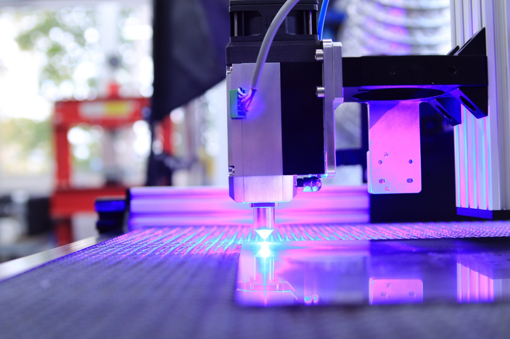
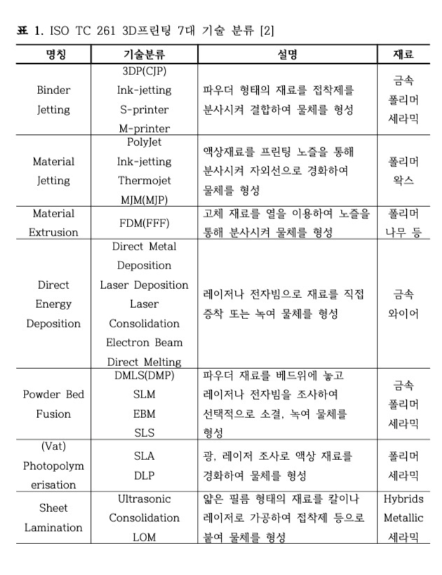

  
이번 포스팅에서는 3D 프린터에 대해 알아보고, 3D 프린팅의 기술에는 어떤 방식이나 종류가 있는지 알아보겠습니다.

  

## 1\. 3D 프린터의 이용 가치

최근 스타트업이 주목을 받으면서, 많이 언급되는 내용이 바로 최소기능제품(Minimum Viable Product, MVP) 입니다. 시장에 혁신을 가져오며, 변화를 주도하는 스타트업(Startup) 에게 필요한 것은 문제를 정의하고 해결하기 위한 가설을 세우는 것이며, 그 가설을 검증하기 위해 만든 것이 바로 MVP 입니다. 

어떤 문제를 어떻게 해결할 것인지에 따라 제품이나 서비스를 만드는 방법은 다양하지만, 하드웨어 제품을 만드는 경우에는 3D 프린터를 많이 이용하는 것으로 알고 있습니다.

  

2018년 ‘3D프린팅 산업 실태조사’ (정보통신산업진흥원, 2018)에 따르면 국내에서는 3D 프린팅 출력물을 주로 시제품(42.7%) 제작과 완제품(27.8%) 제작에 사용하고 있다고 합니다. 

  

  

## 2\. 3D 프린팅이란

3D 프린터는 3D 프린팅 기술로 3차원 물체를 만드는 프린터입니다.

그렇다면 3D 프린팅 기술은 무엇일까요? 3차원 공간에 합성수지, 급속, 박막소재 등의 재료를 적층 가공(Additive manufacturing; AM)으로 쌓아올려 3차원 물체를 만들 수 있는 기술을 의미합니다. 3D프린팅 기술은 기존의 대량생산 체제의 제조방식과 다르게, 신제품 제조에 들어가는 시간과 비용을 최소화 할 수 있습니다. 

  

또한 복잡한 형태의 제품을 생산할 수 있고, 필요에 따라 맞춤형 제품을 생산할 수 있습니다. 이런 장점을 활용해 시제품 제작 이외에도 건축, 전자, 항공, 자동차, 의료, 교육 등으로 수요가 확대되고 있는 상황입니다.

  

  

## 3\. 3D 프린팅 기술의 종류

미국재료시험협회(American Society for Testing Materials, ASTM)의 ISO TC261(Additive Manufacturing)에서는 3D프린팅 기술을 크게 7가지로 분류하였는데, 결합제 분사 방식(Binder jetting), 재료 분사 방식(Material jetting), 재료 압출 방식(Material extrusion), 방향성 에너지 침착 방식(Directed energy deposition), 분말 베드 융합 방식(Powder Bed Fusion), 광중합 방식(Vat Photopolymerization), 판재 적층 방식(Sheet lamination) 입니다.

  

여러분들이 주로 많이 사용하거나 접근이 쉬운 3D 프린터는 바로 재료 압출 방식(Material extrusion) 입니다. 흔히 FDM 혹은 FFF 방식이라고 불리는 대중에게 널리 알려진 3D프린터가 바로 이 방식을 사용하고 있습니다. 

  

3D프린터는 재료의 종류 및 형태나, 적층하는 방식, 적층을 위한 광원의 종류 등에 따라 다양하게 구분할 수 있습니다만, 국제 표준을 만들어가는 ISO 기준에서 3D 프린터는 아래의 7가지 방식으로 기술을 분류하며, 각 특징은 다음 표와 같습니다.



## 마치며

이번 포스팅에서는 3D 프린터를 만들기 위해 사용되는 기술인 3D 프린팅 기술에 대한 정의와, 3D 프린팅 기술 7가지를 알아보았습니다. 자세한 기술에 대한 부분은 블로그 혹은 각 기술별 링크를 클릭하면 관련 내용을 추가적으로 다루고 있으니 참고 부탁드립니다.

```toc
```