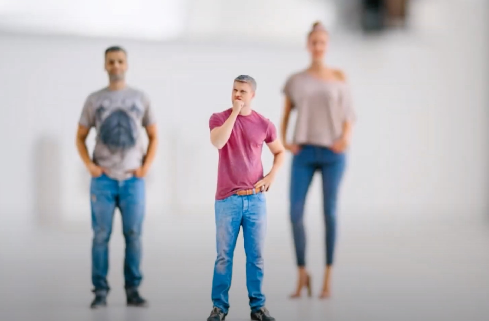
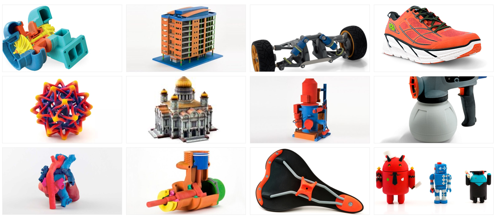
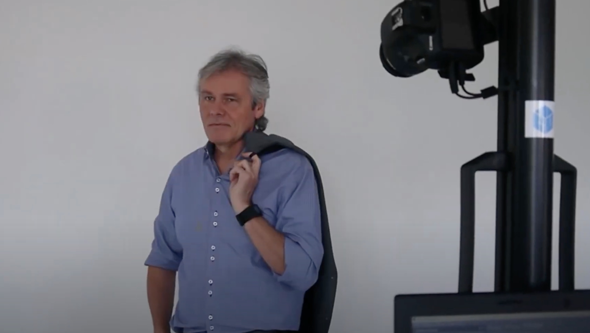
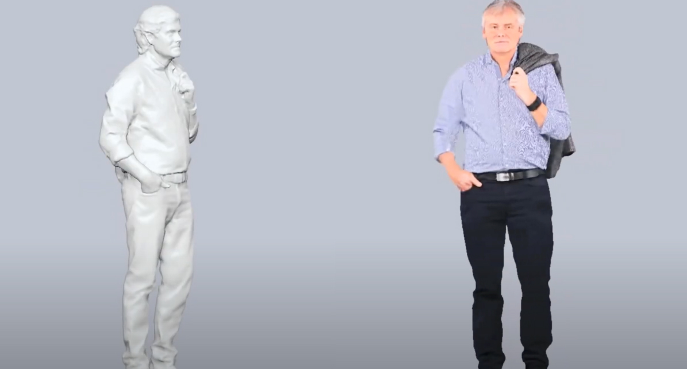
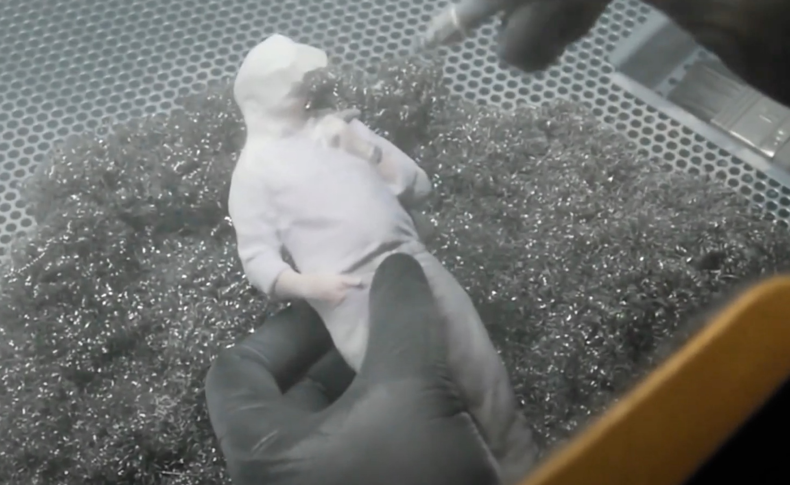
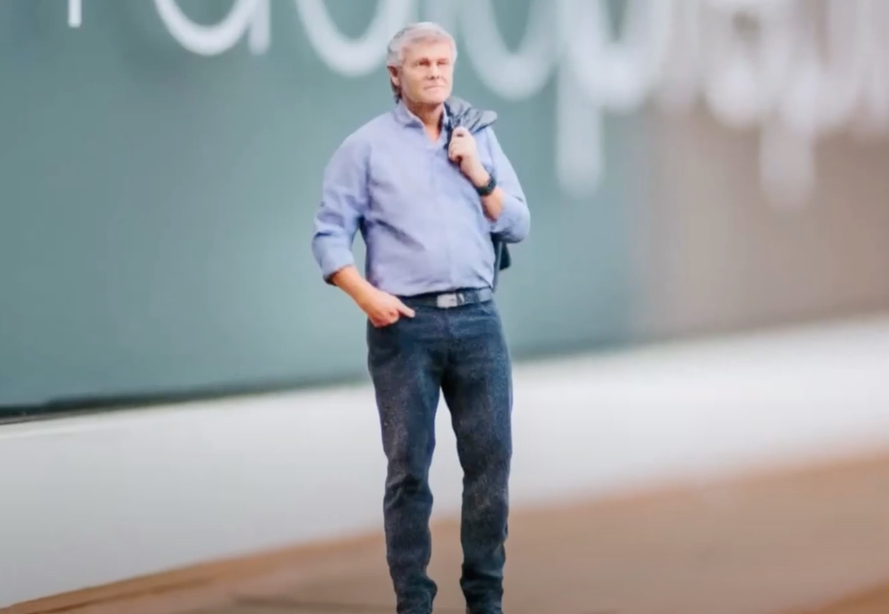

이번 포스팅에서는 색상이 중요한 디자인 컨셉 프로덕트나, 피규어 등과 같은 프로토타입을 만들 때 주로 사용하는 산업용 컬러 3D 프린터인 CJP 3D 프린터에 대해 알아보고, 해당 프린팅 기술의 원리와 주로 사용하는 재료에 대해 알아보겠습니다. 

  
## **1\. CJP 3D 프린터란**

CJP 는 Color Jetting Printing 의 줄인말입니다. 직관적인 영어 명칭대로 2D 잉크젯 프린팅에서 주로 사용하던 CMYK 컬러 잉크 결합제를 사용하여 3차원 구조물을 형성하면서 자연스러운 색상까지 표현이 가능한 프린터입니다. 

  

3D 시스템즈에서 판매하고 있는 ProJet 660 Pro 제품의 경우 600만 가지 이상의 컬러를 표현할 수 있으며, 주로 주조 산업이나 디자인 컨셉, 피규어 및 건축모형 제작 등에 사용됩니다. 다음 이미지에서 보시는 것처럼 다양한 색상을 표현하는 게 필요한 곳에 사용하고 있습니다.



단점으로는 구조물의 강도가 매우 약하고 표면도 거칠기 때문에 반드시 후처리 가공이 필요한 방식입니다.

  

  

## **2\. CJP 3D 프린터의 원리와 역사**

CJP 3D 프린터는 Binder Jetting 이라 불리는 결합제 분사 방식의 원리의 기술을 이용합니다. 간단하게 말하면, 파우더 형태의 재료에 접착제를 분사시켜 결합하여 물체, 즉 구조물을 형성하는 방식입니다. 


결합제 분사 방식은 1988년 ‘Ely Sachs’가 동료들과 함께 미국 MIT(Massachusetts Institute of Technology)에서 처음 개발하였으며 초기에는 3DP (Three-Dimensional Printing)로 불렸습니다. 

  

결합제 분사 방식은 액체상태의 결합제를 선택적으로 침전시켜 도포된 파우더와 결합하는 적층 제조 공정입니다. 2차원 단면과정이 만들어지고 프린트 헤드를 통해 연속적으로 적층하면서 출력하고자 하는 구조물이 제조되는 방식입니다. 

  

액체 상태의 결합제가 도포된 파우더 간의 가교제로 작용하여 액체 상태의 결합제가 뿌려진 부분은 서로 붙어서 굳고, 뿌려지지 않은 부분은 분말상태로 존재하게 되면서 출력하고자 하는 구조물을 형성하게 됩니다. 

  

앞서 말했듯이 강도가 매우 약하고, 표면이 거칠기 때문에 꼭 후처리 공정을 거쳐 액체 상태의 결합제 침투와 경화에 의해 충분한 강도를 가지는 3D 구조물을 제조해야 합니다. FDM 방식의 3D 프린터의 경우 서포팅을 따로 출력해야 하지만, 해당 방식은 파우더 자체가 서포트 역할을 하므로 별도의 서포팅 재료가 필요 없습니다.

  

결합제 분사 방식은 사용되는 액체 상태의 결합제와 도포된 파우더의 상호작용, 파우더 입자 사이즈나 유동성, 충진률 등이 구조물 품질에 영향을 미칩니다. 파우더의 주재료는 금속이나 세라믹(석고), 주물사(Foundry Sand) 등의 모래, 폴리머 등을 사용하고, 액체 상태의 접착제로는 에폭시 수지나 퓨란 수지, 페놀 수지, 무기물 결합제 등을 사용합니다. 

  

결합제 분사 방식을 이용하면 금속, 모래, 세라믹 등 다양한 재료를 적층 가공하는데 적합하고 기공도가 높아 구조물의 밀도가 낮은 특징이 있어 항공, 자동차, 의료, 주조 분야 등 다양한 분야에서 활용할 수 있습니다.

  

결합제 분사 방식에 액체 상태의 결합제 분사를 위해 프린트 헤드가 사용되는데, 이는 잉크젯(ink-jetting) 프린팅 기술을 기반으로 한 것입니다. 잉크젯 프린팅 방식은 작은 액체방울인 액적을 형성하여 프린트 헤드를 통해 잉크를 도포하는 기술입니다. 

  

결합제 분사 방식은 주로 3DP나 CJP(Color Jetting Printing)로 불립니다. 그 이유는 2012년 미국의 3D 시스템즈(3D systems)가 Z-corporation 회사를 인수합병하면서 기존에 3DP 혹은 Z-Corp 방식이라 불렸던 명칭이 CJP 로 변경되었기 때문입니다.

  

## **3\. CJP 3D 프린터 활용 사례**

CJP 는 다양한 사례로 활용하지만, 그 중에 피규어를 만드는 사례에 대해 알아보겠습니다. 먼저 만들고 싶은 피규어를 3D 로 스캔 합니다. 

**1) 3D 스캔**

  


  

**2) 디지털화**

3D 로 스캔한 것을 형태를 디지털화 한 다음, 그 위에 디지털로 색을 입혀줍니다.

  


  

**3) CJP 프린터 출력 후 후가공**

해당 구조물은 석고 분말을 이용하여 출력하였습니다. CJP 프린터 처음에 출력하고 난 뒤에는 석고분말로 둘러쌓여 있기 때문에, 석고 분말을 흡입하여 구조물을 찾아내야 합니다. 석고분말은 재사용이 가능하기 때문에, 흡입하여 다음에 사용할 수 있도록 해줍니다. 

  


  

분말을 모두 제거 한 후 후가공 처리를 통해 구조를 단단하게 만들어주면 피규어가 완성됩니다.

  

**4) CJP 프린팅 완료**




## **4\. 마치며**

이번 포스팅에서는 산업용 3D 프린터 한 종류인 CJP 프린터에 대해 알아보았고, CJP 프린터 원리인 Binder Jetting 방식, 결합제 분사 방식에 대해 알아보았습니다. CJP 프린터는 재료에 대해 제한이 없는 만큼, 다양한 방식으로 사용되고 있으며, 특히 식품 3D 프린터 기술에도 대표적으로 이용되고 있습니다. 전분을 첨가한 설탕이나, 전분 혹은 점도 낮은 액체를 분사하는 방식 등으로 식품 3D 프린터에도 사용되는 기술입니다.

```toc
```