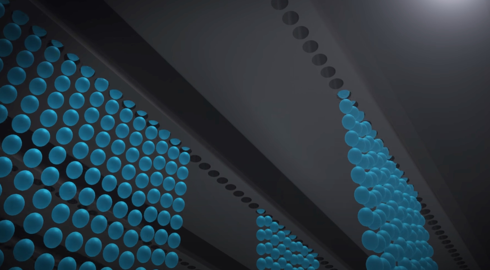
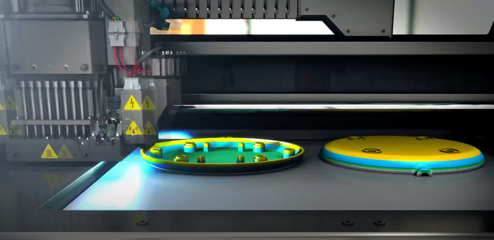
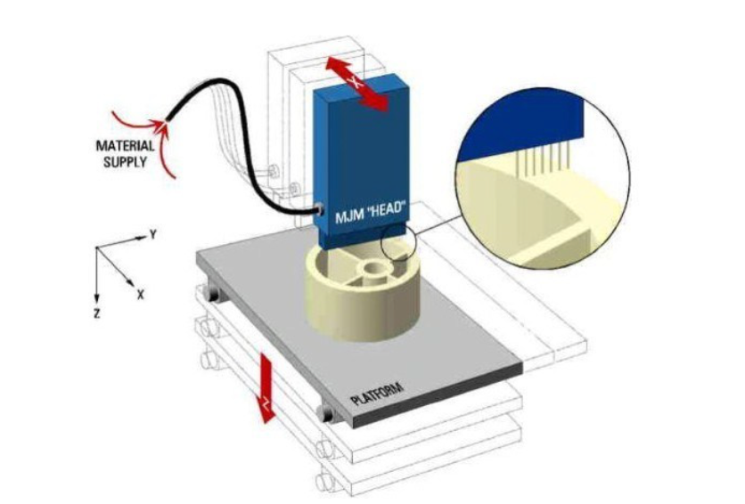
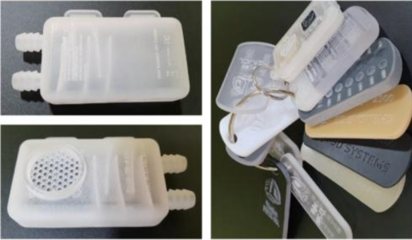

이번 포스팅에서는 3D 프린터 방식 중에 가장 정교하여, 출력만으로도 완제품에 가까운 구조물을 제작할 수 있는 3D 프린터 방식인 소재 분사 방식에 대해 알아보고, 소재 분사 방식의 2가지 기법인 Polyjet 방식과 MJM 방식에 대해 알아보겠습니다. 


## 1\. 소재 분사 방식이란

소재 분사 방식은 소재를 노즐을 통하여 작은 액체방울인 액적(스프레이 등에서 사용되는 것처럼 작고 동글한 물의 덩이를 뜻함) 형태로 빌드 플랫폼 위에 분사하고, 에너지 빔이 선택적으로 소재를 굳혀서 원하는 구조물을 적층 제조하는 방법입니다.

간단하게 말하면 잉크젯 방식과 광경화 방식의 혼합형이라고 보면 됩니다. 

- 광경화 방식에 대해 알아보기

소재분사방식에는 크게 잉크젯 프린팅 기술인 CIJ 방식과 Polyjet 방식이 있으며, Thermojet 방식, MJM혹은 MJP 라고 불리는 방법이 있습니다.

  

## **2\. 잉크젯 프린팅 기술**

잉크젯 프린팅 기술은 액적 형성 방식에 따라 분류할 수 있습니다. 

  

연속적으로 액적을 분사하는 프린팅 방법을 연속식 잉크젯 프린팅(Continuous inkjet; CIJ)이라고 하고, 필요할 때만 액적을 선택적으로 분사하는 프린팅 방법을 DOD 잉크젯 프린팅 (Drop on demand)라고 합니다. 아래의 이미지는 DOD 잉크젯 프린팅으로 현재 파란색 액적을 선택적으로 분사하고 있는 모습입니다. 


CIJ 방식은 연속적으로 프린팅하기 때문에 많은 양의 소재가 필요하고, 구조물로 사용하고 남은 소재들이 오염 등의 문제로 재사용이 어려운 단점이 있습니다. 결합제 분사 방식에서 쓰는 잉크젯 프린팅 방식과 소재 분사 방식에서 사용하는 프린팅 방식 모두 DOD 잉크젯 프린팅 기술을 사용합니다. 이 DOD 잉크젯 방식을 다른말로 Polyjet 방식이라고 합니다.

  

- [결합제 분사 방식에 대해 알아보기](/231121-cjp-3d-printer-binder-jetting)

  

### 2-1. PolyJet(폴리젯) 방식

PolyJet 방식은 2001년 현재는 미국 스트라타시스에 인수된 이스라엘의 Objet사가 발표한 기술로서, 프린터 헤드에 있는 수백 개의 미세 노즐에서 소재를 분사하면서 동시에 자외선으로 경화시켜 구조물을 제조합니다. 

  


굉장히 얇은 층으로 적층되기 때문에 구조물이 균일하고 품질이 뛰어난 특징을 갖고 있습니다. 또한 다양한 물성 혹은 색상을 갖고 있는 소재를 동시에 분사할 수 있어서, 다양한 구조물을 얻을 수 있습니다. 구조물에 사용하는 소재는 아크릴 계열의 광경화성 액상재료를 사용하고, 구조물의 서포팅 소재는 수용성 소재를 사용합니다. 그렇게 되면 향후 서포팅 소재를 제거할 때 수용성이기 때문에 워터젯 기술을 이용하여 쉽게 제거가 가능합니다.

  

그 외 Thermojet 방식도 있습니다. 많이 사용하지 않지만, 이것 역시 DOD 잉크젯 프린팅 기술을 기반으로 개발된 방식입니다. 노즐 내부에 열을 가하여 기포가 발생고 팽창하여 액적을 형성하고 이를 프린팅 하는 방식을 뜻합니다. 

  

## **3\. MJM 방식**

  

MJM(Multi Jet Modeling) 방식은 MJP(Multi Jet Printing)이라고도 불리며, 프린트 헤드에서 주요 소재인 광경화성 수지와 구조물을 지지하기 위한 서포팅 재료인 왁스를 동시에 분사한 뒤, 자외선으로 경화시켜 적층 제조하는 방식입니다. 주요 소재로 사용하는 광경화성 수지는 투명도를 조절 할 수 있어 육안으로 내부를 확인할 수 있는 구조물을 제작할 수 있습니다.

  

모든 3D 프린터를 통틀어 가장 정밀도가 높은 기술이며, 곡선 처리도 뛰어나기 때문에 정밀도가 높은 구조물을 제작할 수 있는 장점이 있습니다. 하지만, 강도가 약하고, 65도 이상의 온도에서는 변형이 발생할 수 있는 단점 또한 존재합니다. 

아래는 투명도를 조절 할 수 있는 MJM 방식으로 제작한 구조물 예시 입니다.

  



## **4\. 마치며**

이번 포스팅에서는 가장 정교한 3D 프린팅 방식은 소재분사방식의 개념에 대해 알아보았고, 가장 많이 사용되고 있는 Polyjet 방식과 MJM 방식의 3D 프린터에 대해 알아보았습니다. 가장 복잡한 형상이나 디테일까지 표현할 수 있는 방식에, 프린팅하는 구조물 한개에 여러 색상까지 조합이 가능한 3D 프린터 방식입니다.

```toc
```